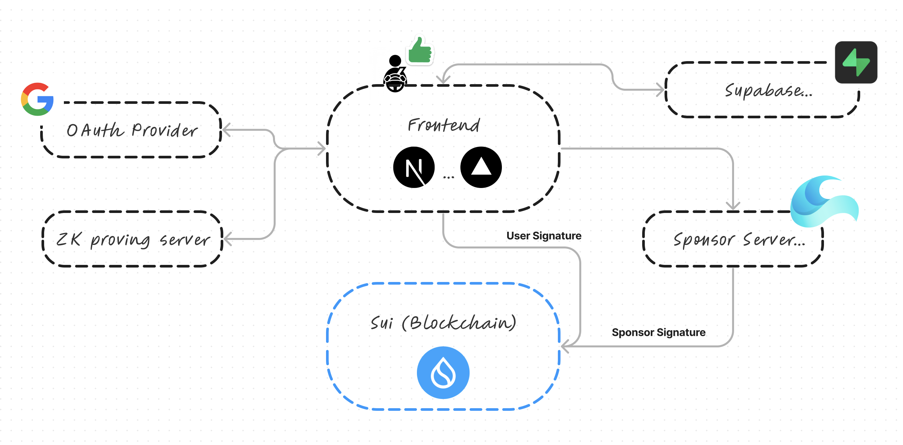
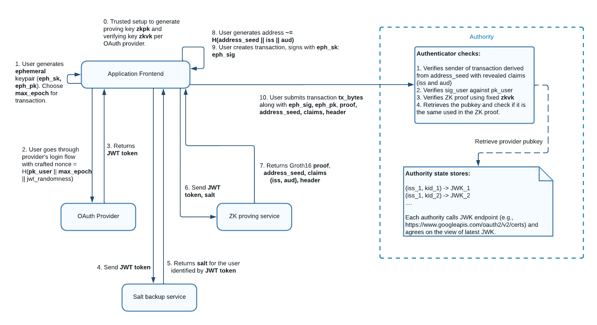
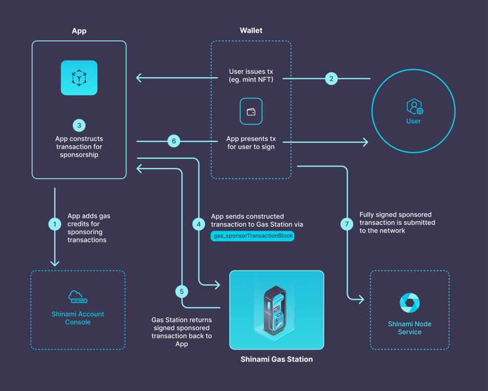

# Enn-Drive

## What it does

「Enn-Drive」は、Web3 テクノロジーを活用して運転者の行動を評価し、より良い運転習慣を促進するための革新的なプラットフォームです。このシステムでは、運転者が互いに「いいね」を通じて肯定的なフィードバックを与え合い、肯定的な運転行動を奨励することで、より安全で快適な運転環境を創造します。

## Features

1. 相互評価システム

   - 運転者が他の運転者の行動を直接評価
   - 運転者はモバイルアプリを通じて、簡単なワンタップ操作で周囲の車に対して「いいね」を送る
   - 運転者が他の運転者から「いいね」を受け取ることで、安全運転や思いやりのある運転行動が正のフィードバックとして認識され、これが運転者の行動変容につながることが期待される

2. 参加障壁を下げる

   - zkLogin と SponsoredTransaction の組み合わせによって、ウォレットを持たない人も楽しめるように
   - 特に、zkLogin ではユーザー側は秘密鍵管理をする必要ない上にセルフカストディアルであることを実現
   - 手軽で安全なブロックチェーン体験を提供

3. 新たな安全運転の価値指標
   - 客観的な評価に基づき、安全運転の新しい基準と価値指標を提供

## Usecase

[Why Blockchain?] ブロックチェーンで管理された個人の運転評価情報は、以下の分野での応用が考えられます：

- **タクシー・配車サービスの質の向上**: タクシーや配車サービスが一般化された現代において、「Enn-Drive」は、優れた運転をするドライバーを見つける手段となり、利用者にとって安心で快適な移動手段を提供します。
- **レンタカー利用**: 優れた運転評価を持つユーザーには、レンタカーの利用料金割引などのメリットを提供します。
- **自動車保険**: 安全運転者への保険料割引や優遇条件の提供に役立てます。
- **個人間カーシェアリング**: 個人間での車の貸し借りを容易にし、信頼性のあるユーザー間の取引を促進します。

## Challenges I ran into

開発中の課題として、最初は特定の車の運転者に対して「いいね」を送ることを考えていましたが、画像認識等で相手の車を特定することは可能ではあるものの、UX の低下やこの機能による事故の発生リスクを考慮し、周囲の車全体に対して「いいね」を送るという設計に変更しました。この変更により、運転者は特定の車両を識別する必要がなく、より安全で簡単に肯定的なフィードバックを提供できるようになりました。また、このシステムでは短期間の運転行動ではなく、長期間にわたる運転者の行動パターンに基づいて評価を行うことで、安全運転を促進し、より信頼性の高い評価システムを実現しています。

## Technologies I used

- Sui ... ブロックチェーン
- zkLogin ... ソーシャルログイン
- Sponsored Transaction ... ガスレストランザクション
- Next.js ... フロントエンド
- Supabase ... DB

## Architecture

- Enn-Drive
  

- zkLogin (https://docs.sui.io/concepts/cryptography/zklogin)
  

- Sponsored Transaction (https://docs.shinami.com/docs/sponsored-transaction-typescript-tutorial)
  

## What's next for

ユースケース拡大の向けて以下のような機能を開発していきます

- 免許証と連携したウォレット生成(zkLogin 拡張)
- 運転データの組み込み
- サードパーティへの統合 SDK
- Mazda 車デバイスとの統合

## Development

View [`Makefile.toml`](./Makefile.toml)

## Member

- **wasabi**: https://github.com/wasabijiro
- **konaito**: https://github.com/konaito
